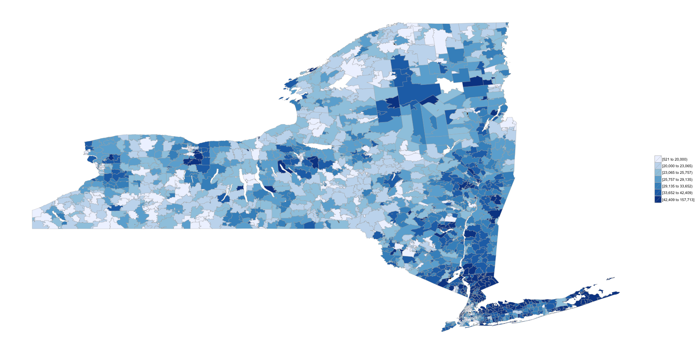

Analyzing Census Data in R
========================================================
author: Ari Lamstein
date: May 2015

Exercise 
========================================================
title: false

Introduce yourself to your neighbor

1. What **state** are you from?
2. What **county** are you from?
3. What **ZIP code** are you from?

Today
========================================================
title:false

Today we will use R to understand the demographics of the

1. **State** you are from
2. **County** you are from
3. **ZIP code** you are from

<br/>
<br/>
<br/>
If time permits we will also:

1. Learn more about the **data**
2. Analyze **historic** data
3. Work directly with the census **API**

Part 1
========================================================

# States

Let's start!
========================================================
title:false


```r
library(choroplethr)
data(df_pop_state)

?df_pop_state
head(df_pop_state)
```

```
      region    value
1    alabama  4777326
2     alaska   711139
3    arizona  6410979
4   arkansas  2916372
5 california 37325068
6   colorado  5042853
```

**Exercise:** What is the population of your home state? Tell your neighbor.

My Answer
======================================================


```r
df_pop_state[df_pop_state$region == "new york", ]
```

```
     region    value
33 new york 19398125
```


Boxplot
========================================================


```r
boxplot(df_pop_state$value)
```

 

**Exercise:** Draw one interpretation from this plot

Choropleth Map 
========================================================


```r
state_choropleth(df_pop_state)
```

 

**Exercise:** Draw one interpretation from this map

Exploratory Data Analysis 
========================================================


```r
state_choropleth(df_pop_state, num_colors = 2)
```

 

**Exercise:** Draw one interpretation from this map

Continuous Scale  
========================================================


```r
state_choropleth(df_pop_state, num_colors = 1)
```

 

**Exercise:** Draw one interpretation from this map

More than population  
========================================================


```r
data(df_state_demographics)
?df_state_demographics

colnames(df_state_demographics)
```

```
[1] "region"            "total_population"  "percent_white"    
[4] "percent_black"     "percent_asian"     "percent_hispanic" 
[7] "per_capita_income" "median_rent"       "median_age"       
```

**Exercise:** Make a choropleth map of one statistic above. Share it with your neighbor.

My answer  
========================================================


```r
df_state_demographics$value = df_state_demographics$percent_white
 
state_choropleth(df_state_demographics, num_colors=2)
```

 

Part 2
========================================================

# Counties

County Population
========================================================


```r
library(choroplethr)
data(df_pop_county)
head(df_pop_county)
```

```
  region  value
1   1001  54590
2   1003 183226
3   1005  27469
4   1007  22769
5   1009  57466
6   1011  10779
```

* (region, value) pairs again
* County FIPS code

County FIPS codes
========================================================

**Exercise:** Use google to find the FIPS code of the county you are from. Share it with your neighbor. 

**Exercise:** What is the population of the county you are from? Share it with your neighbor.
<br/><br/>
*Write down your county FIPS code. We'll be using it later.*

My Answer
========================================================


```r
df_pop_county[df_pop_county$region == 36059, ]
```

```
     region   value
1858  36059 1338712
```

Boxplot
========================================================


```r
boxplot(df_pop_county$value)
```

 

**Exercise:** Draw one interpretation from this boxplot

Choropleth Map
========================================================


```r
county_choropleth(df_pop_county)
```

 

**Exercise:** Draw one interpretation from this map

Choropleth Map
========================================================
title:false

```r
county_choropleth(df_pop_county, num_colors=1)
```

 

**Exercise:** Draw one interpretation from this map

Zoom
========================================================


```r
county_choropleth(df_pop_county, state_zoom="california", num_colors=4)
```

 

**Exercise:** Draw one interpretation from this map

More Demographics
========================================================


```r
data(df_county_demographics)
colnames(df_county_demographics)
```

```
[1] "region"            "total_population"  "percent_white"    
[4] "percent_black"     "percent_asian"     "percent_hispanic" 
[7] "per_capita_income" "median_rent"       "median_age"       
```

**Exercise:** Make a map of some demographic of the counties of your home state. Share it with your neighbor.

My Answer
========================================================


```r
df_county_demographics$value = df_county_demographics$percent_asian

county_choropleth(df_county_demographics, num_colors=1, state_zoom="new york")
```

 

Part 3
========================================================

# ZIP Codes

ZIP Code Population
========================================================


```r
library(choroplethrZip)
data(df_pop_zip)
head(df_pop_zip)
```

```
    region value
132  01001 17380
133  01002 28718
134  01003 11286
135  01005  5120
136  01007 14593
137  01008  1160
```

**Exercise:** What is the population of the zip you are from? Tell your neighbor.

My Answer
========================================================


```r
df_pop_zip[df_pop_zip$region == "11021", ]
```

```
     region value
2811  11021 17449
```

ZIP Code vs. ZCTA
========================================================

Post Office maintains **ZIP Codes**<br/>
Census maintains **Zip Code Tabulated Areas (ZCTA)**

ZIP Codes are difficult to analyze:
  * Aren't polygonal
  * Change freqently
  * Span counties and states
  
Mapping ZCTAs in a State
========================================================


```r
zip_choropleth(df_pop_zip, state_zoom="new york")
```

 

**Exercise:** Draw one inference from this map

Mapping ZCTAs in a County
========================================================


```r
# 36059 is the FIPS code for Nassau County, NY
zip_choropleth(df_pop_zip, county_zoom=36059)
```

 

**Exercise:** Draw one inference from this map

More ZIP Demographics
========================================================


```r
data(df_zip_demographics)
colnames(df_zip_demographics)
```

```
[1] "region"            "total_population"  "percent_white"    
[4] "percent_black"     "percent_asian"     "percent_hispanic" 
[7] "per_capita_income" "median_rent"       "median_age"       
```

**Exercise:** Make a map of some demographic of the ZIPs in your home state. Share it with your neighbor.

My Answer
========================================================


```r
df_zip_demographics$value = df_zip_demographics$per_capita

zip_choropleth(df_zip_demographics, state_zoom="new york")
```

 

**Exercise:** Draw one inference from this map

Exercise
========================================================

**Exercise:** Make a map of some demographic of the ZIPs in your home county. Share it with your neighbor.

My Answer
========================================================


```r
df_zip_demographics$value = df_zip_demographics$per_capita

zip_choropleth(df_zip_demographics, county_zoom=36059, num_colors=1)
```

 

**Exercise:** Draw one inference from this map

