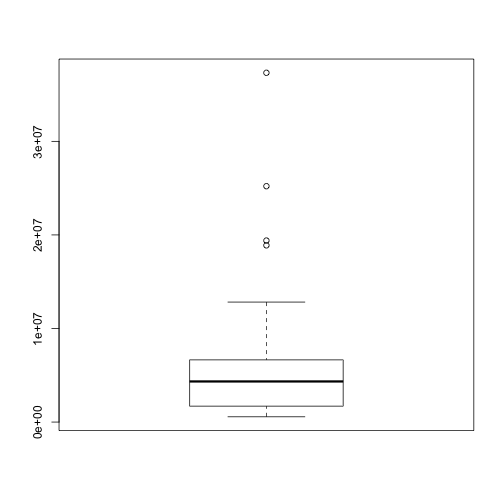

Analyzing Census Data in R
========================================================
author: Ari Lamstein (@AriLamstein)
date: San Francisco R-Ladies Meetup, May 2015

========================================================

Introduce yourself to your neighbor

1. What **state** are you from?
2. What **county** are you from?
3. What **ZIP code** are you from?

========================================================

Today we will use R to understand the demographics of the

1. **State** you are from
2. **County** you are from
3. **ZIP code** you are from

<br/>

Then we will 

1. Analyze **historic** data
2. Look at **more** variables

The Data
========================================================

1. American Community Survey (ACS) 
  * Not the decennial census
2. Very detailed / personal questions
  * "How long is your commute?"
  * "What is your income?"
3. $400B / year is allocated based on the results
  * Where should money for schools go?
4. R's **acs** package 
  * Connects to the Census API Directly
  * Deals with confidence intervals, etc.

Part 1
========================================================

# States

========================================================


```r
library(choroplethr)
data(df_pop_state)

?df_pop_state
head(df_pop_state)
```

```
      region    value
1    alabama  4777326
2     alaska   711139
3    arizona  6410979
4   arkansas  2916372
5 california 37325068
6   colorado  5042853
```

**Exercise:** What is the population of your home state? Tell your neighbor.

My Answer
======================================================


```r
df_pop_state[df_pop_state$region == "new york", ]
```

```
     region    value
33 new york 19398125
```


Boxplot
========================================================


```r
boxplot(df_pop_state$value)
```

 

**Exercise:** Draw one interpretation from this plot

Choropleth Map 
========================================================


```r
state_choropleth(df_pop_state)
```

 

**Exercise:** Draw one interpretation from this map

Exploratory Data Analysis 
========================================================


```r
state_choropleth(df_pop_state, num_colors = 2)
```

 

**Exercise:** Draw one interpretation from this map

Continuous Scale  
========================================================


```r
state_choropleth(df_pop_state, num_colors = 1)
```

 

**Exercise:** Draw one interpretation from this map

More than population  
========================================================


```r
data(df_state_demographics)
?df_state_demographics

colnames(df_state_demographics)
```

```
[1] "region"            "total_population"  "percent_white"    
[4] "percent_black"     "percent_asian"     "percent_hispanic" 
[7] "per_capita_income" "median_rent"       "median_age"       
```

**Exercise:** Make a choropleth map of one statistic above. Share it with your neighbor.

My answer  
========================================================


```r
df_state_demographics$value = df_state_demographics$percent_white
 
state_choropleth(df_state_demographics, num_colors=2)
```

 

Part 2
========================================================

# Counties

County Population
========================================================


```r
library(choroplethr)
data(df_pop_county)
head(df_pop_county)
```

```
  region  value
1   1001  54590
2   1003 183226
3   1005  27469
4   1007  22769
5   1009  57466
6   1011  10779
```

* (region, value) pairs again
* County FIPS code

County FIPS codes
========================================================

**Exercise:** Use google to find the FIPS code of the county you are from. Share it with your neighbor. 

**Exercise:** What is the population of the county you are from? Share it with your neighbor.
<br/><br/>
*Write down your county FIPS code. We'll be using it later.*

My Answer
========================================================


```r
# 36059 is the FIPS code for Nassau County, NY
df_pop_county[df_pop_county$region == 36059, ]
```

```
     region   value
1858  36059 1338712
```

Boxplot
========================================================


```r
boxplot(df_pop_county$value)
```

 

**Exercise:** Draw one interpretation from this boxplot

Choropleth Map
========================================================


```r
county_choropleth(df_pop_county)
```

 

**Exercise:** Draw one interpretation from this map

========================================================

```r
county_choropleth(df_pop_county, num_colors=1)
```

 

**Exercise:** Draw one interpretation from this map

Zoom
========================================================


```r
county_choropleth(df_pop_county, state_zoom="california", num_colors=4)
```

 

**Exercise:** Draw one interpretation from this map

More Demographics
========================================================


```r
data(df_county_demographics)
colnames(df_county_demographics)
```

```
[1] "region"            "total_population"  "percent_white"    
[4] "percent_black"     "percent_asian"     "percent_hispanic" 
[7] "per_capita_income" "median_rent"       "median_age"       
```

**Exercise:** Make a map of some demographic of the counties of your home state. Share it with your neighbor.

My Answer
========================================================


```r
df_county_demographics$value = df_county_demographics$percent_asian

county_choropleth(df_county_demographics, num_colors=1, state_zoom="new york")
```

 

Part 3
========================================================

# ZIP Codes

ZIP Code vs. ZCTA
========================================================

Post Office maintains **ZIP Codes**<br/>
Census maintains **Zip Code Tabulated Areas (ZCTA)**

ZIP Codes are difficult to analyze:
  * Aren't polygonal
  * Change freqently
  * Span counties and states


ZIP Code Population
========================================================


```r
library(choroplethrZip)
data(df_pop_zip)
head(df_pop_zip)
```

```
    region value
132  01001 17380
133  01002 28718
134  01003 11286
135  01005  5120
136  01007 14593
137  01008  1160
```

**Exercise:** What is the population of the zip you are from? Tell your neighbor.

My Answer
========================================================


```r
df_pop_zip[df_pop_zip$region == "11021", ]
```

```
     region value
2811  11021 17449
```
  
Boxplot
========================================================


```r
boxplot(df_pop_zip$value)
```

 

**Exercise:** Draw one interpretation from this boxplot

Mapping ZCTAs in a State
========================================================


```r
zip_choropleth(df_pop_zip, state_zoom="new york")
```

 

**Exercise:** Draw one inference from this map

Mapping ZCTAs in a County
========================================================


```r
# 36059 is the FIPS code for Nassau County, NY
zip_choropleth(df_pop_zip, county_zoom=36059)
```

 

**Exercise:** Draw one inference from this map

Exercises
========================================================

1. Create a choropleth map showing the population of the zip codes in your home state. Share it with your neighbor.

2. Create a choropleth map showing the population of the zip codes in your home county. Share it with your neighbor.

More ZIP Demographics
========================================================


```r
data(df_zip_demographics)
colnames(df_zip_demographics)
```

```
[1] "region"            "total_population"  "percent_white"    
[4] "percent_black"     "percent_asian"     "percent_hispanic" 
[7] "per_capita_income" "median_rent"       "median_age"       
```

**Exercise:** Make a map of some demographic of the ZIPs in your home state. Share it with your neighbor.

My Answer
========================================================


```r
df_zip_demographics$value = df_zip_demographics$per_capita

zip_choropleth(df_zip_demographics, state_zoom="new york")
```

 

**Exercise:** Draw one inference from this map

Exercise
========================================================

**Exercise:** Make a map of some demographic of the ZIPs in your home county. Share it with your neighbor.

My Answer
========================================================


```r
df_zip_demographics$value = df_zip_demographics$per_capita

zip_choropleth(df_zip_demographics, county_zoom=36059, num_colors=1)
```

 

**Exercise:** Draw one inference from this map

Part 4
========================================================

# Historic Data

Technical Details - R
========================================================

* Get a Census API Key: http://api.census.gov/data/key_signup.html
* Then type:


```r
library(acs)
# api.key.install("<key>")
```

Technical Details - Census Bureau
========================================================

* Google "CRAN choroplethr" -> click "Mapping US Census Data"
  


New York in 2010
========================================================

* `?get_state_demographics` 


```r
library(choroplethr)
df_2010 = get_state_demographics(2010, 5)
df_2010[df_2010$region == "new york", 
                          "total_population"]
```

```
[1] 19229752
```

**Exercise**: What was the population of your home state according to the 2010 5-year ACS?

Part 5
========================================================

# More Data

What's Available?
========================================================

* Google "CRAN choroplethr" -> "Mapping US Census Data" 
  


Example: Public Assistance Income
========================================================

* Search for "B19067": AGGREGATE PUBLIC ASSISTANCE INCOME IN THE PAST 12 MONTHS (IN 2012 INFLATION-ADJUSTED DOLLARS) FOR HOUSEHOLDS 


```r
# 6075 is the county FIPS code for San Francisco
zip_choropleth_acs("B19067", county_zoom=6075, num_colors=3)
```

 

Wrapping Up
========================================================

1. Please provide feedback!
  * http://goo.gl/forms/e5DdRqB6rt
  
2. Need a software engineer or data analyst?
  * Want to continue with open source
  
3. Keep in touch!
  * Twitter: @AriLamstein
  * Blog: justanrblog.wordpress.com
  * Email: arilamstein@gmail.com
